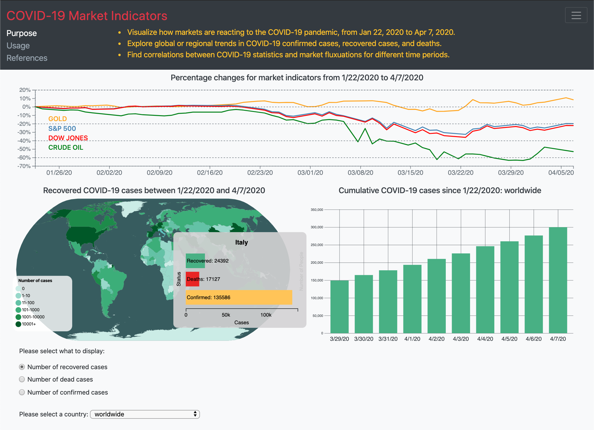

# project_covid19-stocks

A project completed for CPSC 436V (Data Visualization) at the University of British Columbia in collaboration with Brian White and another individual who wishes to remain anonymous.  Posted with permission from course staff.

## Summary

Coronavirus disease (COVID-19) has spread rapidly to hundreds of countries around the world since its recent outbreak in China in late 2019.  Being as the virus is novel, its effect on people is not well understood.  The recent increase of cases arising in patients with no known exposure to infected individuals is an indication that community spread is occurring.  This has led to widespread concern and has caused rapid, unpredictable changes in the US stock market.
To better understand the spread of COVID-19 and its effect on markets, our data visualization provides individuals with a synchronised view of geographical COVID-19 trends and fluctuations in various US stock market indicators.  Our visualization consists of two main parts which in turn have multiple subcomponents:

1. Visualizing market fluctuations: Fluctuations in market indicators, including the S&P 500, Dow Jones Index, crude oil, and gold prices, are presented in an interactive multiple-line chart.
2. Visualizing spread of virus: Geographical trends such as total cases per country, recovered patients, deaths are presented in an interactive choropleth map and an accompanying bar chart.

## Data

We utilized three datasets for our project:

1. [Novel Corona Virus 2019 Dataset](https://www.kaggle.com/sudalairajkumar/novel-corona-virus-2019-dataset) - Data on COVID-19 taken from the World Health Organization, split into a number of different CSV files:
   1. A primary dataset containing serial number, observation date and last update (ordinal, Jan 22, 2020 to Apr 7, 2020), Province/state (categorical, ~300 regions), Country/Region (categorical, ~200 countries), Confirmed, Deaths, and Recovered (quantitative, 0 to >100,000).
   2. Three time different time series files for confirmed, deaths, and recovered cases derived from the main dataset containing Province/State (categorical, ~300 regions), Country/Region (categorical, ~200 countries), Latitude (quantitative, -41.5 to 72), Longitude (quantitative, -158 to 178), and number of cases on a given date from Jan 22, 2020 to Apr 7, 2020 (quantitative, 0 to 22,000 for confirmed cases, 0 to ~700 for deaths, 0 to ~800 for recovered cases).
2. [World Atlas TopoJSON](https://github.com/topojson/world-atlas) - TopoJSON data used to render our choropleth map; countries rather than provinces were used.
3. Yahoo! Finance: [S&P 500](https://finance.yahoo.com/quote/^GSPC/history/), [Gold](https://finance.yahoo.com/quote/GC=F?p=GC=F), [Dow Jones,](https://finance.yahoo.com/quote/^DJI?p=^DJI&.tsrc=fin-srch) and [Crude Oil](https://finance.yahoo.com/quote/CL=F?p=CL=F) consisting of Date (ordinal, Jan 22, 2019 to Apr 7, 2020), Opening, High, Low, Close, Adjusted Close amounts (quantitative, ~2000 to 3500), and Volume (~3 to 9 trillion).
   Note: Among these attributes, only the “Close” attribute was utilized to derive a new attribute showing percentage changes in these closing prices with respect to the first available date (quantitative, -65% to +15%).

Notably, the datasets used for COVID-19 data and for the topojson use different names for each country. For example, "United States of America" in the topojson is "US" in the COVID-19 data. To resolve this problem, we created a dictionary found in js/map/map_dict that maps country names between the two datasets. For the choropleth map, we additionally group the numbers for each country on a given day by using d3.nest() and .rollup() to allow for accurate case counts. Similarly, for the bar chart, we first clean our data and then group numbers by country instead of Province/State.